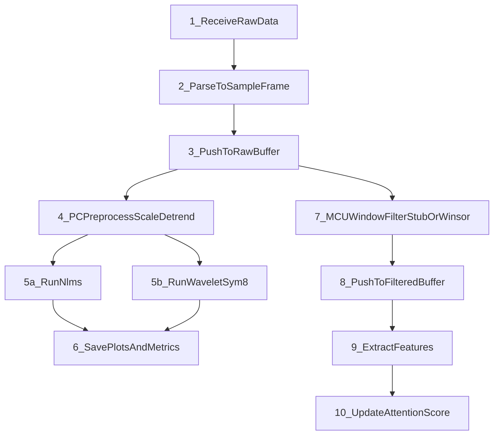

# XIAO nRF52840 Sense EEG/ECG Processing (Skeleton)

Minimal C++ project skeleton for Seeed XIAO nRF52840 Sense using Arduino (Seeed nRF52 Boards 1.1.12).  
Focus: clean structure, SOLID-friendly interfaces, and clear extension points for BLE/USB data ingestion, windowed filtering, feature extraction, and attention scoring.

## Target Hardware
- MCU: Nordic nRF52840 (ARM Cortex-M4F, 64 MHz)
- Memory: 256 KB RAM, 1 MB Flash, 2 MB external Flash
- Connectivity: BLE 5.2 / NFC

## Project Structure
```
/src
  main.cpp
  ble_receiver.cpp
  ganglion_parser.cpp
  signal_buffer.cpp
  filters.cpp
  features.cpp
  attention.cpp
  host_parsers.cpp
  memory_manager.cpp
/include
  ble_receiver.h
  ganglion_parser.h
  signal_buffer.h
  filters.h
  features.h
  attention.h
  host_parsers.h
  memory_manager.h
```

## Architecture Diagram (ASCII)
```
 [BLE/USB] -> [BleReceiver] -> [GanglionPacketParser] -> [SignalBuffer Raw]
                                                     |
                                                     +--> [PC Compare Pipeline]
                                                     |      |- Preprocess (scale+detrend)
                                                     |      |- NLMS reference subtraction
                                                     |      |- Wavelet denoise (sym8)
                                                     |      |- Plots + benchmark metrics (95% CI)
                                                     |
                                                     +--> [MCU Runtime Pipeline]
                                                            |- WinsorizedMedianWindowFilter (active)
                                                            |- NlmsReferenceWindowFilter (stub)
                                                            |- WaveletSym8WindowFilter (stub)
                                                            -> [SignalBuffer Filtered] -> [Features] -> [Attention]

 MemoryManager -> shared allocation interface for MCU modules
```

## Processing Sequence (ASCII)
```
1) Receive raw data (BLE/USB)
2) Parse to SampleFrame (GanglionPacketParser)
3) Push to raw buffer
4) Read window from raw buffer
5) Window filter process (winsorize + masked median)
6) Push to filtered buffer
7) Extract features
8) Update attention score
```

## Architecture Diagram
```mermaid
flowchart LR
    BleReceiver[BleReceiver(BLEorUSB)] --> Parser[GanglionPacketParser]
    Parser --> RawBuffer[SignalBufferRaw]

    RawBuffer --> PcCompare[PCComparePipeline]
    PcCompare --> PcPre[PreprocessScaleAndDetrend]
    PcPre --> PcNlms[NlmsReferenceSubtraction]
    PcPre --> PcWavelet[WaveletSym8Denoise]
    PcNlms --> PcViz[PlotsAndBenchmarkCI95]
    PcWavelet --> PcViz

    RawBuffer --> McuFilter[MCUWindowFilter]
    McuFilter --> Winsor[WinsorizedMedianActive]
    McuFilter --> NlmsStub[NlmsReferenceStub]
    McuFilter --> WaveletStub[WaveletSym8Stub]
    Winsor --> FilteredBuffer[SignalBufferFiltered]
    NlmsStub --> FilteredBuffer
    WaveletStub --> FilteredBuffer
    FilteredBuffer --> FeatureExtractor[IFeatureExtractor]
    FeatureExtractor --> AttentionEngine[AttentionEngine]

    MemoryManager[MemoryManager] --- McuFilter
    MemoryManager --- FilteredBuffer
    MemoryManager --- FeatureExtractor
    MemoryManager --- AttentionEngine
```

## Pipeline
1. Input formats: BLE stream from Ganglion (18-bit, 19-bit, raw 24-bit, ASCII/impedance).
2. Parsing: `GanglionPacketParser` converts packets to `SampleFrame`.
3. PC preprocessing: scaling to uV (auto/Ganglion) and detrending.
4. PC dual-filter test:
   - NLMS adaptive reference subtraction (`eeg1/eeg2` cleaned with `eeg3` reference).
   - Wavelet denoising using `sym8`.
5. PC outputs:
   - RAW vs NLMS, RAW vs Wavelet, RAW vs NLMS vs Wavelet, NLMS vs Wavelet.
   - Performance figure: latency/CPU/memory with 95% CI + big-O notes.
6. MCU runtime:
   - active filter = winsorized median.
   - NLMS + wavelet pipeline represented by clean stubs pending on-device profiling.
7. Feature extraction + attention engine on filtered buffer.

## Input / Output Formats
- MCU input: BLE packets from Ganglion.
- Host input: CSV, EDF, annotations (.txt/.xml/.json).
- Additional annotation formats to consider: TSV, EDF+ annotation channel, BDF, EEGLAB `.set`, MNE `.fif`.

## Processing Sequence


## Components
- `BleReceiver`: transport stub for BLE/USB input; provides raw frames via callback.
- `GanglionPacketParser`: parses Ganglion BLE packets (18/19-bit, raw, ASCII/impedance).
- `SignalBuffer`: storage for `SampleFrame` with window reading support.
- `IWindowFilter`: processes blocks of frames; `DummyWindowFilter` is placeholder.
- `IFeatureExtractor`: computes features from filtered data.
- `AttentionEngine`: computes a single attention score from features.
- `MemoryManager`: centralized allocation/monitoring stub.
- `HostParsers`: stubs for CSV/EDF/annotation parsing on PC.

## Data Model
`SampleFrame` represents one time point:
- `channels[0..1]` = EEG (channels 1–2)
- `channels[2]` = ECG (channel 3)
- `channels[3]` = reserved/noise (channel 4)

## Notes
- All logic is **stubbed** and must be implemented for real data.
- Windowed filtering is the default approach (block processing).
- Design allows exporting both raw and filtered data for storage/visualization/PC transfer.

## Build/Upload
Use Arduino IDE with **Seeed nRF52 Boards 1.1.12** selected and target **Seeed XIAO nRF52840 Sense**.

## PC Preliminary Processing & Visualization (Python)

### Install dependencies
```bash
pip install numpy pandas matplotlib mne PyWavelets
```

### CLI User Guide (Git Bash)
Use these commands from the repository root:

1) Compare NLMS vs Wavelet(sym8) on EEG channels 1 and 2 using ECG reference channel 3:
```bash
python pc/plot_preliminary.py \
  --csv "Datasets_Ganglion/BrainFlow-RAW_2026-02-01_13-44-55_0.csv" \
  --preset eeg \
  --reference-channel 3 \
  --mode compare \
  --benchmark-runs 20 \
  --no-show
```

2) Tune NLMS (more taps and slower adaptation):
```bash
python pc/plot_preliminary.py \
  --csv "Datasets_Ganglion/BrainFlow-RAW_2026-02-01_13-44-55_0.csv" \
  --channels 1,2 \
  --reference-channel 3 \
  --mode nlms \
  --nlms-taps 24 \
  --nlms-mu 0.04 \
  --nlms-delay 2 \
  --benchmark-runs 30 \
  --no-show
```

3) Tune wavelet denoising (sym8):
```bash
python pc/plot_preliminary.py \
  --csv "Datasets_Ganglion/BrainFlow-RAW_2026-02-01_13-44-55_0.csv" \
  --channels 1,2 \
  --mode wavelet \
  --wavelet sym8 \
  --wavelet-level 0 \
  --wavelet-threshold-scale 1.0 \
  --benchmark-runs 30 \
  --no-show
```

### Full CLI Flags (what each one does)
Command:
```bash
python pc/plot_preliminary.py [FLAGS]
```

#### Input and channel selection
- `--csv <path>`  
  Input CSV/TSV file. Required.  
  Example: `--csv "Datasets_Ganglion/BrainFlow-RAW_2026-02-01_13-44-55_0.csv"`

- `--preset <eeg|ecg|all>`  
  Quick channel preset:
  - `eeg` -> channels 1,2
  - `ecg` -> channel 3
  - `all` -> channels 1,2,3,4  
  Default: `eeg`.

- `--channels <list>`  
  Manual channel override (comma-separated, no spaces), e.g. `1,2` or `1,2,3,4`.  
  If provided, this overrides `--preset`.

- `--reference-channel <1..4>`  
  Reference channel used by NLMS (typically ECG-like channel 3).  
  Default: `3`.

#### Filter mode
- `--mode <compare|nlms|wavelet>`  
  - `compare`: run both filters and generate all comparison plots
  - `nlms`: run only NLMS path
  - `wavelet`: run only Wavelet path  
  Default: `compare`.

#### Preprocessing
- `--scale <auto|ganglion|none>`  
  Controls scaling to microvolts:
  - `auto`: apply Ganglion factor only when amplitude looks like raw counts
  - `ganglion`: always apply Ganglion scaling
  - `none`: keep values unchanged  
  Default: `auto`.

- `--detrend <none|mean|median>`  
  Removes DC offset before denoising:
  - `none`: no DC removal
  - `mean`: subtract mean
  - `median`: subtract median (robust to outliers)  
  Default: `median`.

#### NLMS parameters
- `--nlms-taps <int>`  
  Number of adaptive filter taps (`L`). More taps can model longer ECG leakage paths but increase compute.  
  Default: `16`.

- `--nlms-mu <float>`  
  Adaptation step size. Larger values adapt faster but may become unstable/noisy.  
  Default: `0.06`.

- `--nlms-eps <float>`  
  Small stabilizer to avoid divide-by-zero in NLMS normalization.  
  Default: `1e-6`.

- `--nlms-delay <int>`  
  Delays the reference by N samples to better align ECG contamination timing in EEG channels.  
  Default: `2`.

#### Wavelet parameters
- `--wavelet <name>`  
  Wavelet family/name from PyWavelets, e.g. `sym8`, `db4`, `coif5`.  
  Default: `sym8`.

- `--wavelet-level <int>`  
  Decomposition level.  
  - `0` means auto/max valid level
  - positive values force a level up to max allowed  
  Default: `0`.

- `--wavelet-threshold-scale <float>`  
  Multiplies wavelet threshold strength:
  - higher -> stronger denoising, more risk of EEG attenuation
  - lower -> gentler denoising, more residual artifacts  
  Default: `1.0`.

#### Benchmark and output
- `--benchmark-runs <int>`  
  Repetitions per channel/method for latency/CPU/memory stats and 95% CI.  
  Default: `20` for typical compare usage (script default is `20`).

- `--output <path>`  
  Custom output CSV path. If omitted, auto-generated as `<input>_compare_filters.csv`.

- `--plot-dir <path>`  
  Custom directory for generated PNG figures and metrics CSV.  
  If omitted, auto-generated as `<input>_plots`.

- `--no-show`  
  Do not open matplotlib windows (recommended for batch/headless runs).  
  Figures are still saved to disk.

#### Quick recommendations
- First baseline run:
  - `--mode compare --preset eeg --reference-channel 3 --benchmark-runs 20 --no-show`
- If NLMS underperforms:
  - increase taps (`--nlms-taps 24`), reduce step size (`--nlms-mu 0.03..0.05`)
- If wavelet over-smooths EEG:
  - reduce `--wavelet-threshold-scale` (e.g., `0.8`)

### Generated Outputs
- Comparison CSV: `<input>_compare_filters.csv`
- Plot directory: `<input>_plots/`
  - `eeg1_raw_vs_nlms.png`
  - `eeg1_raw_vs_wavelet.png`
  - `eeg1_raw_nlms_wavelet.png`
  - `eeg1_nlms_vs_wavelet.png`
  - same set for `eeg2` (or selected channels)
  - `performance_metrics_ci95.png`
  - `performance_metrics_ci95.csv`

### Performance Metrics Definition
- Latency: wall-clock runtime from filter start to filter finish per channel.
- CPU usage estimate: `process_time / wall_time * 100` per run.
- Memory usage: `tracemalloc` peak KiB per run.
- CI: 95% confidence interval computed as `mean +/- 1.96 * std / sqrt(n)`.
- Big O:
  - NLMS (`L` taps): time `O(N*L)`, memory `O(L)`.
  - Wavelet DWT: time `O(N)`, memory `O(N)` for full signal buffers.
