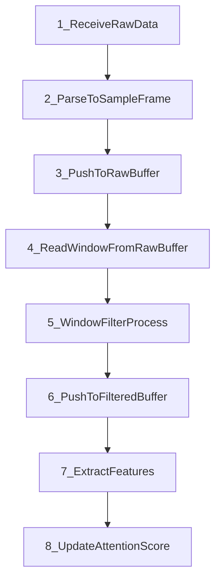

# XIAO nRF52840 Sense EEG/ECG Processing (Skeleton)

Minimal C++ project skeleton for Seeed XIAO nRF52840 Sense using Arduino (Seeed nRF52 Boards 1.1.12).  
Focus: clean structure, SOLID-friendly interfaces, and clear extension points for BLE/USB data ingestion, windowed filtering, feature extraction, and attention scoring.

## Target Hardware
- MCU: Nordic nRF52840 (ARM Cortex-M4F, 64 MHz)
- Memory: 256 KB RAM, 1 MB Flash, 2 MB external Flash
- Connectivity: BLE 5.2 / NFC

## Project Structure
```
/src
  main.cpp
  ble_receiver.cpp
  signal_buffer.cpp
  filters.cpp
  features.cpp
  attention.cpp
  memory_manager.cpp
/include
  ble_receiver.h
  signal_buffer.h
  filters.h
  features.h
  attention.h
  memory_manager.h
```

## Architecture Diagram (ASCII)
```
 [BLE/USB]
     |
     v
 +-------------+     +------------------+     +------------------+
 | BleReceiver | --> | SignalBuffer Raw | --> | IWindowFilter    |
 +-------------+     +------------------+     +------------------+
                                               |
                                               v
                                       +---------------------+
                                       | SignalBuffer Filter |
                                       +---------------------+
                                               |
                                               v
                                       +---------------------+
                                       | IFeatureExtractor   |
                                       +---------------------+
                                               |
                                               v
                                       +---------------------+
                                       | AttentionEngine     |
                                       +---------------------+

 MemoryManager --> (used by all modules)
```

## Processing Sequence (ASCII)
```
1) Receive raw data (BLE/USB)
2) Parse to SampleFrame
3) Push to raw buffer
4) Read window from raw buffer
5) Window filter process
6) Push to filtered buffer
7) Extract features
8) Update attention score
```

## Architecture Diagram
```mermaid
flowchart LR
    BleReceiver[BleReceiver\n(BLE/USB input)] --> RawBuffer[SignalBuffer Raw]
    RawBuffer --> WindowFilter[IWindowFilter\n(Window Processing)]
    WindowFilter --> FilteredBuffer[SignalBuffer Filtered]
    FilteredBuffer --> FeatureExtractor[IFeatureExtractor]
    FeatureExtractor --> AttentionEngine[AttentionEngine]

    MemoryManager[MemoryManager] --- BleReceiver
    MemoryManager --- RawBuffer
    MemoryManager --- WindowFilter
    MemoryManager --- FilteredBuffer
    MemoryManager --- FeatureExtractor
    MemoryManager --- AttentionEngine
```

## Processing Sequence


## Components
- `BleReceiver`: transport stub for BLE/USB input; provides raw frames via callback.
- `SignalBuffer`: storage for `SampleFrame` with window reading support.
- `IWindowFilter`: processes blocks of frames; `DummyWindowFilter` is placeholder.
- `IFeatureExtractor`: computes features from filtered data.
- `AttentionEngine`: computes a single attention score from features.
- `MemoryManager`: centralized allocation/monitoring stub.

## Data Model
`SampleFrame` represents one time point:
- `channels[0..1]` = EEG (channels 1–2)
- `channels[2]` = ECG (channel 3)
- `channels[3]` = reserved/noise (channel 4)

## Notes
- All logic is **stubbed** and must be implemented for real data.
- Windowed filtering is the default approach (block processing).
- Design allows exporting both raw and filtered data for storage/visualization/PC transfer.

## Build/Upload
Use Arduino IDE with **Seeed nRF52 Boards 1.1.12** selected and target **Seeed XIAO nRF52840 Sense**.
